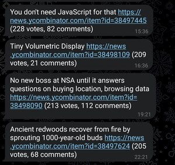

# hn-telegram

A [Telegram](https://web.telegram.org/) bot that sends notifications on [Hacker News](https://news.ycombinator.com/) stories that reach 200 upvotes or 200 comments.



## Usage

1. [Create a bot using BotFather](https://core.telegram.org/bots/tutorial#obtain-your-bot-token)
2. Install `hn-telegram`, execute it, and send a message to the bot to retrieve your channel ID:
   ```console
   $ cargo install --git https://github.com/cpg314/hn-telegram
   $ hn-telegram --token XXX
   ```
3. Execute `hn-telegram` again with your channel ID:
   ```
   $ hn-telegram --token XXX --id YYY
   ```

By default, notifications are send every 15 minutes. This can be customized with the `--schedule` flag.
